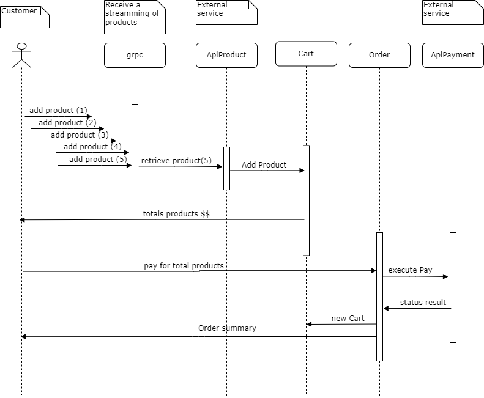
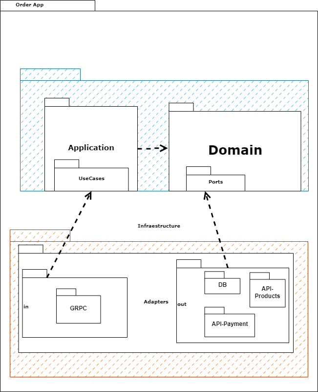

# E-Delivery
## Order App

Application that manage the Shopping Cart (Cart) tracking adding products and the payment of that cart, if the payment 
is successful the client will receive an Order.

### Use Case Diagram


### Sequence Diagram


### Package Diagram
Here we can see the Dependency Inversion principle, it's the business side of the application how controls the 
dependencies, according to clean architecture.



### Configuration
Configuration steps for local environment:

1) Install Java 17
2) Install Rancher Desktop
3) Configure the database, execute by command line:
   1) docker pull cassandra
   2) docker run --name order-db -p 9042:9042 -d cassandra:latest
   3) docker exec -it order-db bash -c "cqlsh -u cassandra -p cassandra"
   4) CREATE KEYSPACE order_keyspace WITH replication = { 'class': 'SimpleStrategy', 'replication_factor':1}
   5) exit
4) execute in the root folder: ./gradlew bootRun 

### Run with Oauth2 authentication mode

Run the gradle application with the "prod" profile:

```gradle
./gradlew :order-app:bootRun --args='--spring.profiles.active=prod'
```